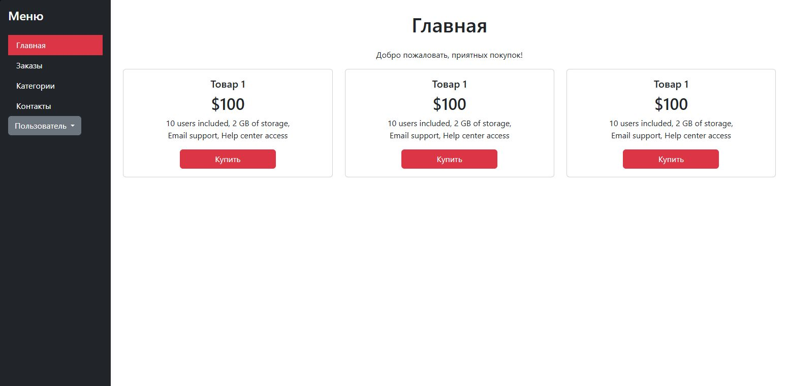
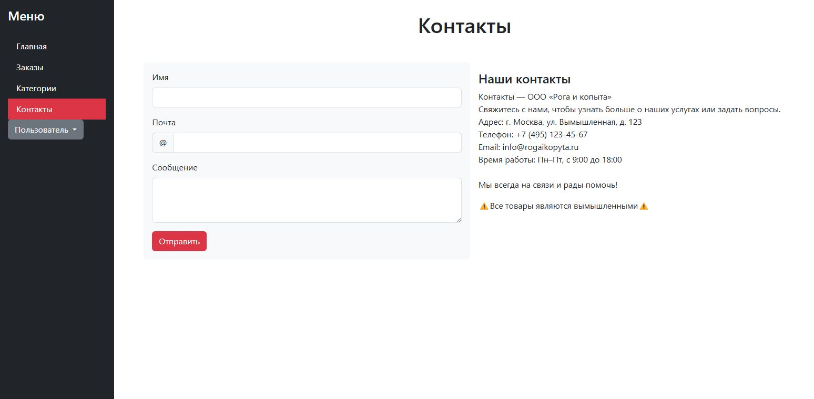

<h3 style="background: linear-gradient(257deg, Gold, green); -webkit-background-clip: text; color: transparent;">
  Проект ОНЛАЙН МАГАЗИН на django "
</h3> 

# 🔖 Описание проекта:

Данный проект является интернет-магазином на фреймворке DJANGO 


# 🔧 Установка компонентов:


1. Создайте проект и установите poetry:


```pip install --user poetry```


2. Установите инструменты для реализации магазина

[]( https://www.djangoproject.com/ )
[]( https://pypi.org/project/python-dotenv/ )
[]( https://pypi.org/project/psycopg2/ )
[]( https://pypi.org/project/Pillow/ )
[]( https://pypi.org/project/ipython/ )

КОМАНДЫ ДЛЯ ЗАПУСКА ФРЕЙМВОРКА И ПРИЛОЖЕНИЯ
```
poetry add django # Установка
poetry add pillow # Установка библиотеки для работы с изображениями
poetry add dotenv # Установка библиотеки для работы с чувствительными данными
poetry add ipython # Установка библиотеки для работы с чувствительными данными

django-admin startproject config . # Старт нового проекта
django-admin startproject myproject # Старт нового приложения

python manage.py createsuperuser # дать суперпользователя для админки.
При выполнении этой команды необходимо указать имя пользователя и пароль.
Адрес электронной почты является опциональным параметром.

python manage.py shell -i ipython #Запуск DJANGO SHELL

```

# ✒️ Использование
Основное использование приложения запускается из файла *manage.py*

```
python -Xutf8 manage.py dumpdata catalog.Category --output category_fixture.json --indent 4  #Гененрация фикстуры модели
python manage.py loaddata products_fixture_load.json --database=default --ignorenonexistent #Загрузка данных из фикстуры
python manage.py add_test_product # запуск кастомной функции добавление тестового продукта(старые данные стираются!)

```

⚠️ ВАЖНО ⚠️
```
python manage.py runserver 8080 # Запуск сервера
CTRL+С # Отключение сервера
```
### 🌐 Пример страниц:




# Структура проекта
```
HW_22_Django/
├── 📁 catalog/ # Приложение Django
│ ├── 📁 fixture/ # Сгенерированые фикстуры БД
│ ├── 📁 migrations/ # Миграции базы данных
│ ├── 📁 management/ # Пакет для кастомных команд
│ │ ├── 📁 commands/ # Пакет для кастомных команд с самими командами
│ │      ├── 📝 init .py # Пустой файл, обязательный для Python
│ │      ├── 📝 add_test_product.py # Кастомная команда
│ ├── 📁 templates/ # Шаблоны HTML
│ │ ├── 📊 category.html
│ │ ├── 📊 contacts.html
│ │ └── 📊 home.html
│ │ └── 📊 order.html 
│ ├── 📝 init .py # Пустой файл, обязательный для Python
│ ├── 📝 admin.py # Настройки админки Django
│ ├── 📝 apps.py # Конфигурация приложения
│ ├── 📝 models.py # Модели данных
│ ├── 📝 tests.py # Тесты
│ ├── 📝 urls.py # URL-маршруты приложения
│ └── 📝 views.py # Вьюхи (представления)
├── 📁 config/ # Корневые настройки проекта
│ ├── 📝 init .py # Пустой файл, обязательный для Python
│ ├── 📝 asgi.py # Настройки ASGI (асинхронный сервер)
│ ├── 📝 settings.py # Основные настройки проекта
│ ├── 📝 urls.py # Глобальные URL-маршруты
│ └── 📝 wsgi.py # Настройки WSGI (синхронный сервер)
├── 📁 static/ # Статические файлы (CSS, JS, изображения)
├── 📄 .flake8 # Настройки flake8 (статический анализатор кода)
├── 📄 .gitignore # Файл игнорирования Git
├── 📄 db.sqlite3 # База данных SQLite
├── 📝 manage.py # Утилита управления проектом Django
├── 📄 poetry.lock # Зависимости Poetry
└── 📄 pyproject.toml # Конфигурация Poetry
```

# 📝 Документация 

Для получения дополнительной информации обратитесь к [документации](https://api.hh.ru/openapi/redoc#section)
